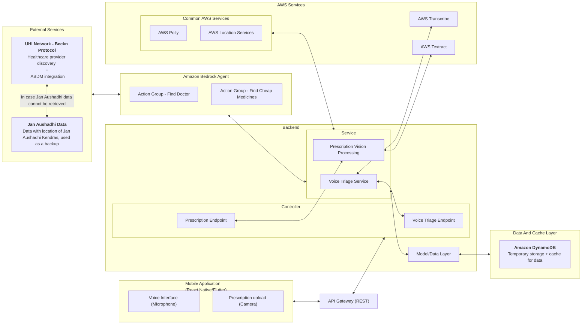
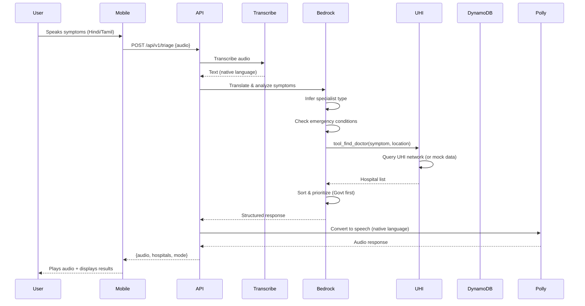
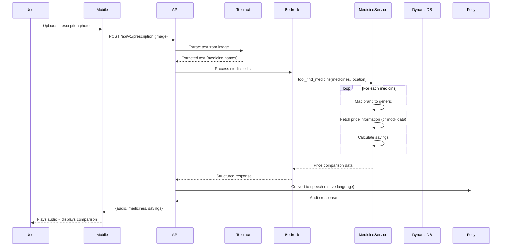

# Design Document: Sahayak - AI Health Agent for Rural India

## Overview

Sahayak is a mobile-first, multi-modal AI health agent designed to bridge healthcare access gaps for rural Indian populations. The system leverages ABDM’s UHI network and government healthcare schemes, powered by AI to provide voice-based doctor discovery and vision-based medicine finding capabilities, specifically targeting non-English speaking users in rural areas.

### Core Capabilities

1. **Voice-First Doctor Discovery**: Users speak symptoms in their native language, and the system performs intelligent triage to recommend appropriate specialists and find nearby healthcare providers via the UHI network
2. **Vision-Based Medicine Finder**: Users upload prescription photos, and the system extracts medicine names, maps brands to generics, and finds the cheapest alternatives at Jan Aushadhi Kendras
3. **Multilingual Support**: All interactions support multiple Indian languages with voice input/output
4. **Cost Optimization**: Prioritizes free government hospitals (PMJAY) and generic medicines to reduce healthcare costs
5. **Emergency Escalation**: Identifies potentially dangerous symptoms early and alerts users to seek urgent hospital care

### Design Principles

- **Mobile-First**: Optimized for smartphone usage with touch and voice interfaces
- **Low-Bandwidth Friendly**: Optimized for rural network conditions
- **Safety-First**: Medical triage prioritizes patient safety by over-estimating urgency
- **Privacy-Preserving**: No persistent storage of sensitive health data (audio, images)
- **Hackathon-Ready**: Mock data integration for rapid development and demonstration

#### Medical Safety Disclaimer
- Sahayak does not provide medical diagnosis or treatment advice.
- The system performs symptom-based triage for access and urgency classification only and always recommends consultation with qualified healthcare professionals.

## Architecture

### High-Level System Architecture



### Data Flow Diagrams

#### Voice Triage Flow



#### Vision Processing Flow



### Technology Stack

#### Frontend
- Voice and camera access using native mobile APIs


#### Backend
- **Framework**: Python FastAPI (preferred for AI/ML integration) or Node.js Express
- **API Documentation**: OpenAPI/Swagger
- **Environment**: AWS Lambda + API Gateway (serverless) 

#### AWS Services
- **Amazon Bedrock**: Agent orchestration with Claude 3.5 Sonnet model
- **Amazon Transcribe**: Speech-to-text with Hindi and Tamil language support
- **Amazon Polly**: Text-to-speech with neural voices for Hindi and Tamil
- **Amazon Textract**: OCR for prescription image processing
- **Amazon Location Service**: Geocoding and distance calculations
- **Amazon DynamoDB**: NoSQL database for caching and session management
- **AWS CloudWatch**: Basic logging for demo observability
- **Amazon S3**: Temporary storage for uploaded images during processing


#### External Protocols
- **Beckn Protocol**: UHI network integration for healthcare provider discovery
- **REST APIs**: Standard HTTP/JSON for all service communication

## Components and Interfaces

### 1. Mobile Application

**Responsibilities**:
- Capture voice input and prescription images
- Display results in Emergency Mode (red) or Savings Mode (green)
- Play audio responses
- Handle user interactions and navigation
- Request and manage location permissions
- Focus on accessibility to reach wider population 

**UI Modes**:

1. **Emergency Mode (Red Theme)**: Triggered for high-risk symptoms; highlights nearby emergency-ready hospitals and shows helpline 108

2. **Savings Mode (Green Theme)**: Highlights Jan Aushadhi options and cost savings on prescribed medicines

3. **Normal Mode**: Default doctor discovery with both government and private options


### 2. API Gateway Layer

**Responsibilities**:
- Route requests to appropriate backend services
- Handle authentication and rate limiting
- Validate request payloads

**Endpoints**:
```
POST /api/v1/triage
  - Body: multipart request with audio and metadata
  - Response: TriageResponse

POST /api/v1/prescription
  - Body: multipart/form-data (image file, language, location)
  - Response: PrescriptionResponse

GET /api/v1/health
  - Response: { status: "healthy", timestamp: ISO8601 }
```

### 3. Voice Triage Module

**Responsibilities**:
- Transcribe audio using Amazon Transcribe
- Translate native language to English if needed
- Coordinate with Bedrock Agent for symptom analysis
- Generate audio responses using Amazon Polly
- Validates audio clarity and requests re-recording if needed

**Processing Flow (High-Level)**:
1. Transcribe spoken symptoms in the user’s native language
2. Analyze symptoms and infer specialist and urgency
3. Discover nearby government and private hospitals via UHI
4. Respond with voice and visual guidance in the user’s language


**Multilingual Support**:
- Supported input languages: Hindi (hi-IN), Tamil (ta-IN), and other Indian languages supported by Amazon Transcribe
- Internal translation handled transparently for processing
- All responses delivered back in the user’s native language
- All error messages and clarifying questions presented in user's native language

### 4. Vision Module

**Responsibilities**:
- Extract text from prescription images using Amazon Textract
- Validate image quality (resolution, lighting, blur)
- Coordinate with Bedrock Agent for medicine processing

**Processing Flow**:
1. Validates prescription image clarity 
2. If image quality is poor (blurry, dark, or low resolution), return error with tips for better photo
3. Temporarily process image for OCR and discard after extraction
4. Extract text using Amazon Textract detect_document_text
5. Parse extracted text to identify medicine names (both brand and generic)
6. If no medicine names detected, request clearer image
7. Invoke Bedrock Agent with medicine list and location
8. Clean up temporary S3 storage immediately after processing
9. Return PrescriptionResponse with medicines, savings, and locations

### 5. Bedrock Agent Orchestrator

**Responsibilities**:
- Coordinate multi-step workflows
- Invoke action groups (tool_find_doctor, tool_find_medicine)
- Maintain conversation context across session
- Determine emergency conditions based on symptom analysis
- Classify symptoms into specialist types

**Supported Specialist Types** (minimum 10 categories):
1. General Physician (default for unclear symptoms)
2. Cardiologist (heart-related symptoms)
3. Dermatologist (skin conditions)
4. Pediatrician (children's health)
5. Gynecologist (women's health)
6. Orthopedic (bone and joint issues)
7. ENT (Ear, Nose, Throat)
8. Ophthalmologist (eye conditions)
9. Dentist (dental issues)
10. Psychiatrist (mental health)
11. Gastroenterologist (digestive system)
12. Neurologist (nervous system)

**Emergency Condition Detection**:
The Bedrock Agent activates Emergency_Mode when symptoms indicate:
- Chest pain or pressure (potential heart attack)
- Severe bleeding or hemorrhage
- Difficulty breathing or shortness of breath
- Loss of consciousness or fainting
- Severe head injury
- Stroke symptoms (facial drooping, arm weakness, speech difficulty)
- Severe allergic reactions
- Poisoning or overdose
- Severe burns
- Severe abdominal pain


### 6. UHI Discovery Service

**Responsibilities**:
- Search UHI network using Beckn Protocol
- Prioritize government hospitals over private clinics
- Calculate distances using Amazon Location Service
- Handle location permissions and manual entry fallback

**Location Handling**:
1. On application start, request location permissions from user
2. If permissions granted, use Amazon Location Service to get GPS coordinates
3. If permissions denied, prompt for manual location entry (city/district/pincode)
4. Cache location in session for subsequent requests
5. Use road distance (not straight-line) for all distance calculations

**Service Logic**:
1. Query UHI network for matching providers
2. Prioritize PMJAY-enabled government hospitals
3. Sort results by proximity and emergency capability
4. Return top relevant options to the user


### 7. Medicine Price Service

**Responsibilities**:
- Map brand names to generic salt names
- Fetch prices from multiple sources
- Calculate savings percentages
- Find nearest Jan Aushadhi Kendras
- Maintains a curated mapping of common brand-to-generic medicines


**Service Logic**:
1. For each medicine name, attempt to map brand to generic salt name using internal database
2. If medicine is already a generic name, use it directly without mapping
3. If medicine name is ambiguous (multiple possible matches), return all options for user selection
4. If medicine name is unrecognized, request clarification from user
5. Fetch price information from available data sources or mock data
6. Find nearest Jan Aushadhi Kendras using location service (maximum 3 locations)
7. Calculate savings percentage: ((brand_price - jan_aushadhi_price) / brand_price) * 100
8. If medicine unavailable at Jan Aushadhi, indicate unavailability and show only brand prices
9. Return list of MedicineComparison objects with top 3 Jan Aushadhi locations per medicine


### System Guarantees
- Always prioritizes government hospitals when available
- Escalates potentially dangerous symptoms to urgent care
- Never stores raw audio or prescription images
- Always presents generic medicine savings when available
- Responds in the user’s native language


## Error Handling
- Errors are communicated clearly in the user’s native language
- The system guides users on how to retry or correct inputs
- In urgent scenarios, emergency helpline information is shown immediately
- The system prioritizes showing partial results over failing completely


### Error Handling Strategies

1. **Graceful Degradation**
   - If TTS fails, return text response only - for accessibility, text response can be read aloud by the client device's inbuilt screen reader
   - If cache is unavailable, proceed with direct API calls
   - If location service fails, allow manual location entry
   - If prescription OCR fails, allow manual prescription entry

2. **User Guidance**
   - Provide specific instructions for fixing input errors
   - Suggest alternative actions when searches return no results
   - Offer emergency helpline numbers when system is unavailable

3. **Retry Logic**
   - Automatic retry with exponential backoff for transient failures
   - User-initiated retry option for all errors
   - Maximum 3 automatic retries before requiring user action

4. **Logging and Monitoring**
   - Log all errors with full context for debugging
   - Track error rates by category
   - Alert on error rate thresholds (>5% of requests)

### Emergency Mode Error Handling

When in Emergency_Mode, error handling should be optimized for speed:
- Skip optional processing steps
- Provide emergency helpline immediately in error messages
- Reduce retry attempts to 1 to avoid delays
- Prioritize showing any available results over perfect results

## Testing Strategy

- Manual end-to-end testing using mock data
- Simulated emergency and non-emergency scenarios
- Demo validation with Hindi/Tamil voice inputs and handwritten prescriptions


### Environment Configuration

**Development Environment**:
- Use mock data (hospitals.json, medicines.json) for rapid development
- Local DynamoDB for caching
- Reduced property test iterations (20)
- Debug logging enabled for troubleshooting

**Staging Environment**:
- Mix of mock and real AWS services for testing
- Real DynamoDB with test data
- Full property test suite
- Standard logging level

**Production Environment**:
- All real AWS services
- Real UHI network integration
- Production DynamoDB with auto-scaling
- CloudWatch monitoring and alarms enabled

### Scalability Considerations

1. **Lambda Concurrency**: Set reserved concurrency for critical functions
2. **DynamoDB**: Use on-demand billing for unpredictable traffic
3. **API Gateway**: Enable throttling (1000 requests/second per user)
4. **Bedrock**: Monitor token usage and implement rate limiting
5. **S3**: Use lifecycle policies to delete temp images after 1 day

### Cost Optimization

1. **Caching**: Aggressive caching reduces AWS service calls
2. **Mock Data**: Use in development to avoid AWS costs
3. **Batch Processing**: Batch multiple medicines in single Bedrock call
4. **Image Compression**: Compress prescription images before upload
5. **Audio Streaming**: Stream TTS audio instead of storing in S3
