# Sahayak - Making Healthcare Accessible

Sahayak is a mobile-first application that aims to make healthcare more accessible to Indians, with a special focus on rural India where healthcare may be difficult to access due to lack of information of facilities, language barriers, etc.

## [Download the APK for the app here](https://github.com/SaanviSingh12/AIForBharatCode/releases/tag/v0.0.1)

- Click on the app-debug.apk to download.
- You may have to enable installation from unknown sources in your android settings.
- Play Protect may warn you that the app is not trusted - this is expected, as our app is a *debug* version. It has not been signed yet.

## Screenshots

    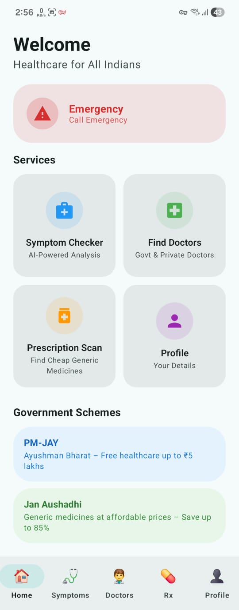
    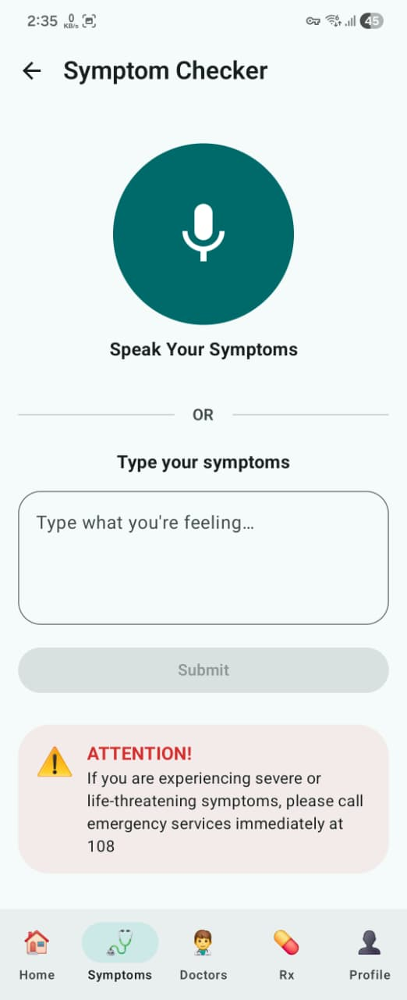
    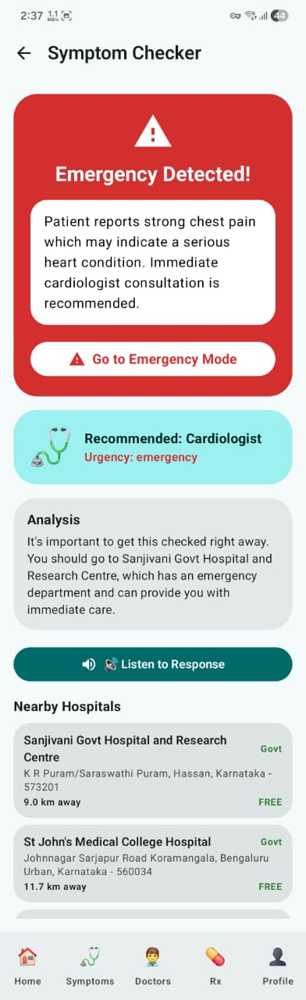
    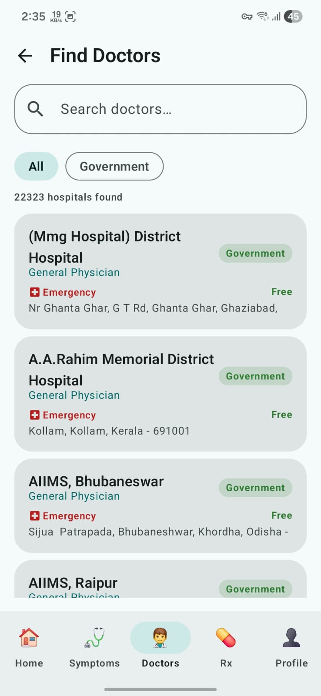
    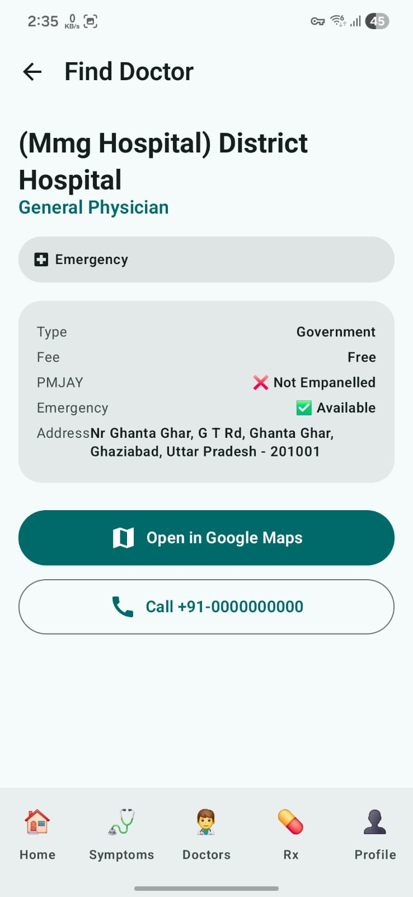
    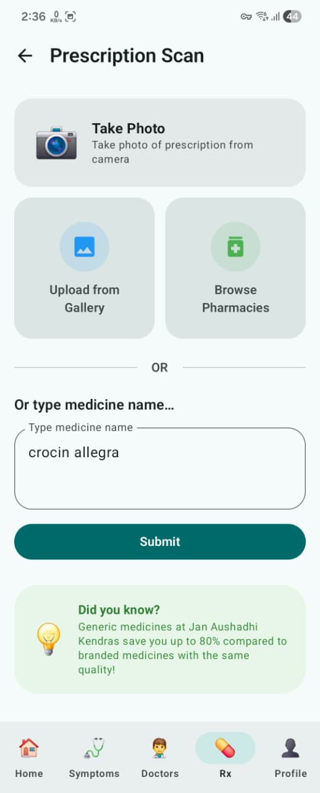
    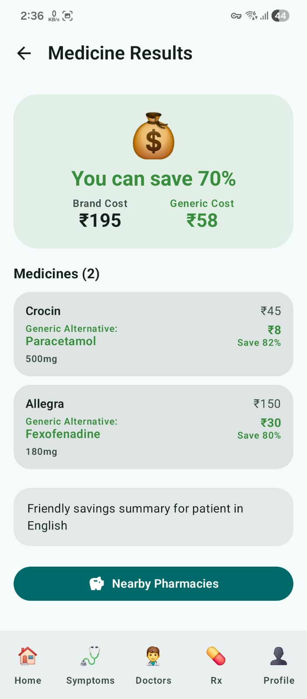
    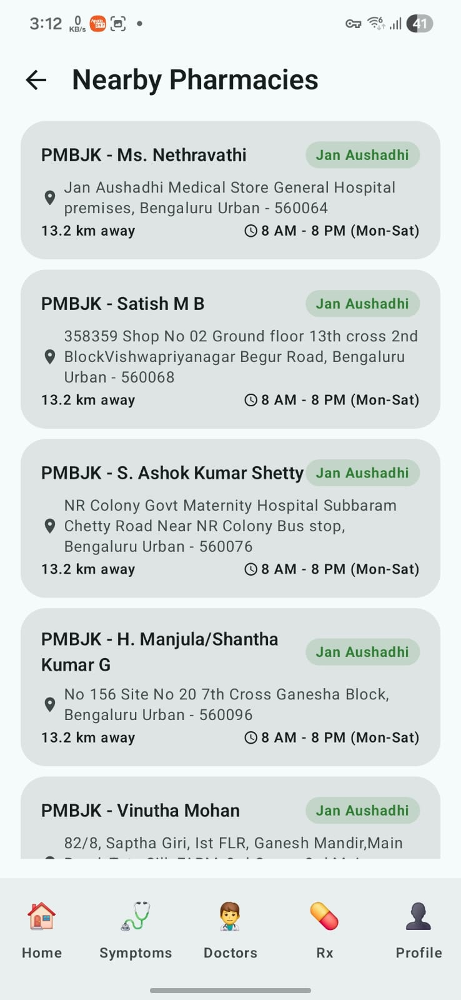
    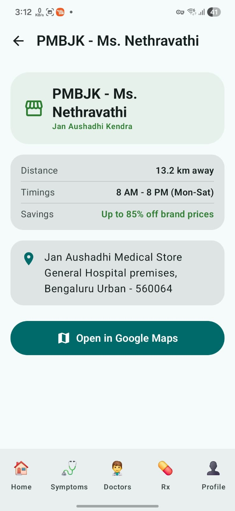
    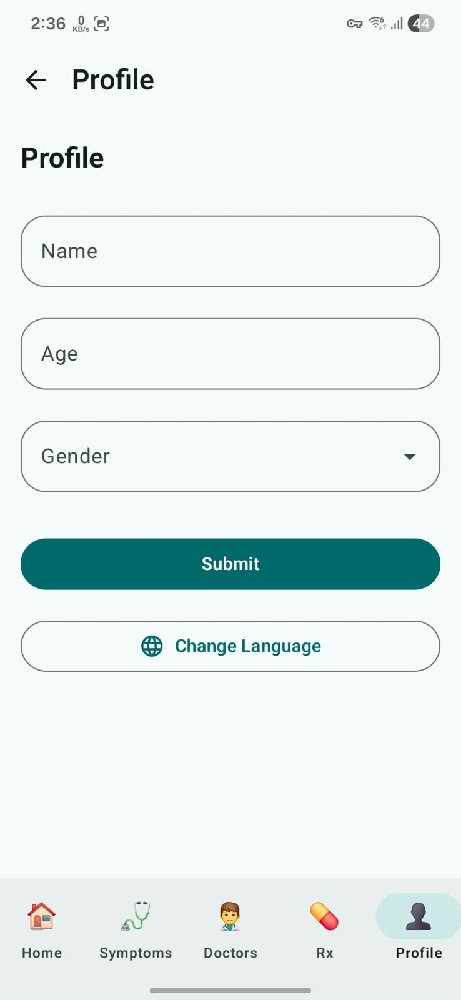
    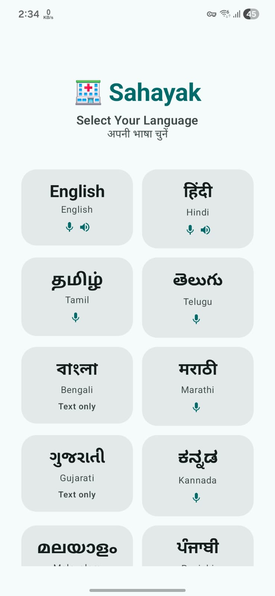
    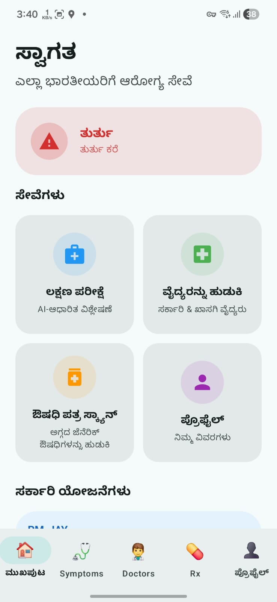
    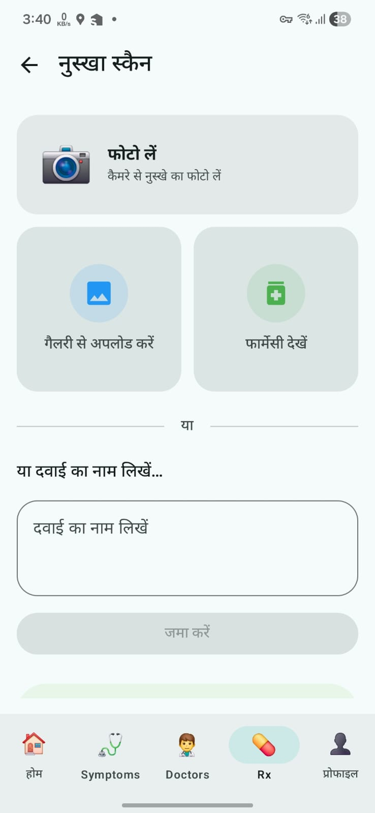

## Repo Structure

This app was developed using React Native, Kotlin, and Java + Spring Boot.

Folder structure is as follows:
- Healthcare Access Mobile App --> Contains the react frontend used for testing
- sahayak-backend --> Backend files of Java + Spring Boot
- sahayak-android --> Contains the android app, which functions as the main frontend.

